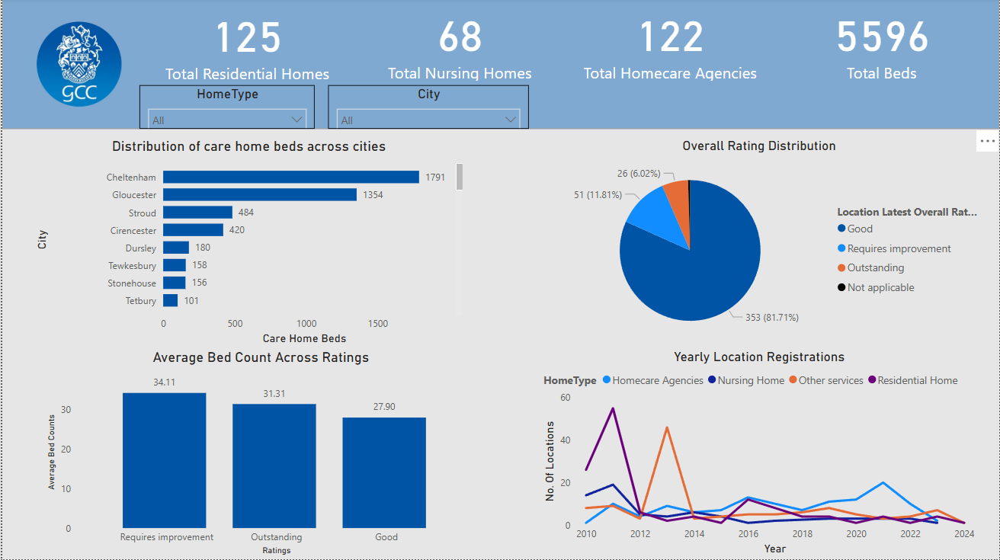

# 🏥 CQC Adult Care Home Analysis (Power BI)

## 📋 Overview
This Power BI dashboard explores adult care facilities in Gloucestershire using publicly available data from the Care Quality Commission (CQC). It aims to surface insights around service availability, provider ratings, and regional performance trends.

## 🧰 Tools Used
- Power BI (visualisation, data modelling, DAX)
- SQL (for data querying and filtering)
- Excel (for pre-cleaning)
- CQC CSV dataset (external)

## 🔍 Key Insights
- Identified postcode regions with high density of “Requires Improvement” ratings
- Mapped regional care coverage gaps and visualised distribution by provider type
- Used interactive filters for location, rating, and service type

## 📸 Dashboard Preview

## 📂 Files & Access
- 📎 [.pbix Power BI File](./CQC%20dataset%20dashboard.pbix)
- 📎 [Dashboard (PDF Version)](./CQC%20dataset%20dashboard%20pdf.pdf)
- 🔗 [Full Dataset (Google Drive, 36MB)](https://docs.google.com/spreadsheets/d/1Xcd1wMkqgz4oOEEWe1Ei8QYOR8QvlYq6/edit?usp=drive_link&ouid=112876228268181029331&rtpof=true&sd=true)

## 🧠 Skills Demonstrated
- Creating interactive dashboards for decision-making
- Using DAX to build performance metrics
- Communicating complex data through visuals
- Geospatial mapping and filtering in Power BI

---

> 📁 [Return to Main Portfolio](..)
