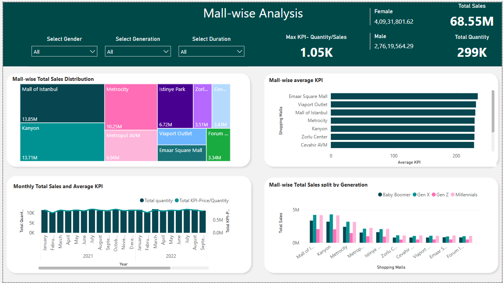

# 🛒 Customer Sales Insights (Power BI)

## 📋 Overview
This Power BI dashboard was created to analyse customer purchasing behaviour from a retail dataset. As one of my first visualisation projects, it focuses on basic metrics like product performance, customer segmentation, and overall sales trends.

## 🧰 Tools Used
- Power BI (basic visualisation, DAX)
- Excel (data cleaning)
- Retail transaction dataset (CSV)

## 🔍 Key Insights
- Top-performing product categories by total sales
- Purchase behaviour segmented by gender and age
- Overall revenue contribution and average basket size

## 📸 Dashboard Preview

## 📂 Files & Access
- 📎 [.pbix Power BI File](./Customer_sales_dashboard.pbix)
- 📎 [Dataset (CSV)](./Customer_sales_dataset.csv)

## 🧠 Skills Demonstrated
- Basic dashboard design and layout structuring
- Initial use of DAX for simple KPIs
- Data import and transformation in Power BI
